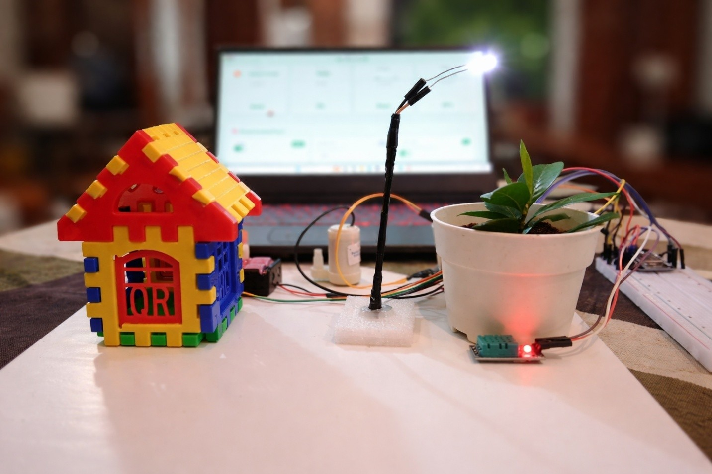
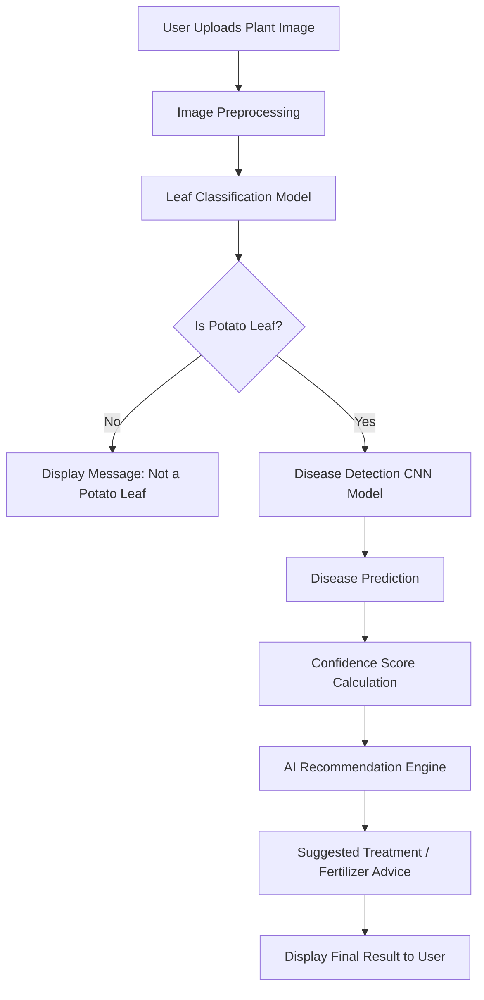

<!-- PROJECT BANNER -->

<h1 align="center">
🌱 AI Smart Home Plantation System
</h1>

AI + IoT Based Smart Plant Monitoring and Disease Detection System

---

# 🌿 Project Overview

The **AI Smart Home Plantation System** is an intelligent plant monitoring solution that integrates **IoT sensors, artificial intelligence, and web technology** to help monitor plant health and detect plant diseases automatically.

The system uses **environmental sensors** and **AI-based leaf disease detection** to assist home gardeners in maintaining healthy plants.

---

# 🖥 System Prototype

### Hardware Components

- NodeMCU ESP8266
- Soil Moisture Sensor
- DHT11 Temperature Sensor
- Water Pump
- Smart Light System
- Plant Pot Monitoring

---

# 🧠 AI Plant Disease Detection

The AI model detects **plant leaf diseases using deep learning**.

Main focus diseases:

🍃 Potato Early Blight  
🍃 Potato Late Blight  
🍃 Healthy Leaf Detection

The model analyzes leaf images and predicts plant health conditions.

---

# 🧬 AI Potato Leaf Disease Detection System Workflow

